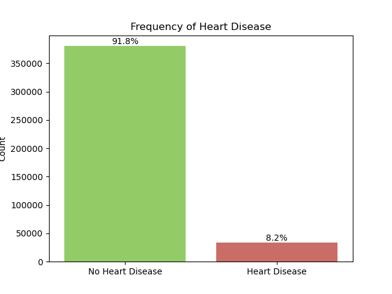

# Heart Disease Classification

## Contents:
- [Problem Statement](#Problem-Statement)
- [Data Source](#Data-Source)
- [Data Cleaning](#Data-Cleaning)
- [Data Dictionary](#Data-Dictionary)
- [Exploratory Data Analysis](#Exploratory-Data-Analysis)
- [Data preprocessing](#Data-Preprocessing)
- [Model Building](#Model-Building)
- [Conclusions and Recommendations](#Conclusions-and-Recommendations)
- [Notebook Descriptions](#Notebook-Descriptions)
- [Software Requirements](#Software-Requirements)

## Problem Statement
The goal of this study is to develop machine learning classification models for heart disease prediction and inference that accurately identifies individuals at risk of developing the condition. We will utilize the CDC's BRFSS 2021 dataset to do our research. We plan to optimize for balanced accuracy and choose the model with high recall so that means those who are sick are identified as often as possible. Leveraging relevant health and demographic data, the model will assist healthcare professionals in targeting preventive measures, enhancing patient outcomes, and reducing the overall burden of heart disease on the healthcare system.

## Data Source
Our data is derived from the [Behavioral Risk Factor Surveillance System, or BRFSS, for the year 2021](https://www.cdc.gov/brfss/annual_data/annual_2021.html). This system is a product of the Centers for Disease Control and Prevention, or the CDC, which conducts health-related telephone surveys annually to collect state data about U.S. residents regarding their health-related risk behaviors, chronic health conditions, and the use of preventive services. There’s over 400,000 individuals and 300 potential features in the [original dataset](https://www.cdc.gov/brfss/annual_data/2021/files/LLCP2021XPT.zip). These variables capture a broad range of data from demographic details such as age, sex and race, to behavioral factors like smoking, alcohol consumption, and physical activity levels. We also have information on chronic health conditions, preventative health measures, and access to healthcare services.

## Data Cleaning
First, we need to use domain knowledge to identify and remove any irrelevant or redundant columns from the dataset. We also eliminate columns that have an excess of missing data. Observations without a target label are discarded, as are rows with a high count of missing values. Next, we reference the Dataset Dictionary to handle missing values appropriately. Our data is represented by numbers, which means we need to convert some column values to their corresponding category names, following the code book. For categorical variables, if a missing value is actually indicating a distinct category such as 'Not Sure' or 'Not Asked', rather than being truly missing, we replace it accordingly and mark truly missing values as 'missing'. Similarly, for numerical variables, we label and assign values based on the code book's guidelines, and impute any remaining missing values with the median.

## Data Dictionary
|Feature|Type|Dataset|Description|
|---|---|---|---|
|**_michd**|object|cleaning_data_phase2.csv|If have heart disease or not|
|**_state**|object|cleaning_data_phase2.csv|State of U.S.|
|**_sex**|object|cleaning_data_phase2.csv|Calculated sex variable|
|**genhlth**|object|cleaning_data_phase2.csv|General Health|
|**physhlth**|float64|cleaning_data_phase2.csv|Number of Days Physical Health Not Good|
|**menthlth**|float64|cleaning_data_phase2.csv|Number of Days Mental Health Not Good|
|**addepev3**|object|cleaning_data_phase2.csv|(Ever told) you had a depressive disorder|
|**checkup1**|object|cleaning_data_phase2.csv|Length of time since last routine checkup|
|**_totinda**|object|cleaning_data_phase2.csv|Adults who reported doing physical activity or exercise during the past 30 days other than their regular job|
|**_rfhype6**|object|cleaning_data_phase2.csv|Adults who have been told they have high blood pressure by a doctor, nurse, or other health professional|
|**cholmed3**|object|cleaning_data_phase2.csv|Currently taking medicine for high cholesterol|
|**_rfchol3**|object|cleaning_data_phase2.csv|High Cholesterol Calculated Variable|
|**cvdstrk3**|object|cleaning_data_phase2.csv|Ever Diagnosed with a Stroke|
|**_asthms1**|object|cleaning_data_phase2.csv|Computed asthma status|
|**chcscncr**|object|cleaning_data_phase2.csv|(Ever told) you had skin cancer|
|**chcocncr**|object|cleaning_data_phase2.csv|(Ever told) you had any other types of cancer|
|**chccopd3**|object|cleaning_data_phase2.csv|Ever told you had C.O.P.D. emphysema or chronic bronchitis|
|**chckdny2**|object|cleaning_data_phase2.csv|Ever told you have kidney disease|
|**diabete4**|object|cleaning_data_phase2.csv|(Ever told) you had diabetes|
|**_drdxar3**|object|cleaning_data_phase2.csv|Respondents diagnosed with arthritis|
|**marital**|object|cleaning_data_phase2.csv|Marital Status|
|**children**|float64|cleaning_data_phase2.csv|Number of Children in Household|
|**_incomg1**|object|cleaning_data_phase2.csv|Computed income categories|
|**employ1**|object|cleaning_data_phase2.csv|Employment Status|
|**htm4**|float64|cleaning_data_phase2.csv|Computed Height in Meters|
|**wtkg3**|float64|cleaning_data_phase2.csv|Computed Weight in Kilograms|
|**_bmi5**|float64|cleaning_data_phase2.csv|Computed body mass index|
|**decide**|object|cleaning_data_phase2.csv|Difficulty Concentrating or Remembering|
|**diffwalk**|object|cleaning_data_phase2.csv|Difficulty Walking or Climbing Stairs|
|**diffdres**|object|cleaning_data_phase2.csv|Difficulty Dressing or Bathing|
|**_smoker3**|object|cleaning_data_phase2.csv|Four-level smoker status: Everyday smoker, Someday smoker, Former smoker, Non-smoker|
|**usenow3**|object|cleaning_data_phase2.csv|Frequency of using chewing tobacco|
|**ecignow1**|object|cleaning_data_phase2.csv|Do you now use e-cigarettes, every day, some days, or not at all|
|**_drnkwk1**|float64|cleaning_data_phase2.csv|Calculated total number of alcoholic beverages consumed per week|
|**_metstat**|object|cleaning_data_phase2.csv|Metropolitan Status|
|**_imprace**|object|cleaning_data_phase2.csv|Imputed race/ethnicity value (If no response, imputed with most common race for that region)|
|**_age80**|float64|cleaning_data_phase2.csv|Imputed Age value collapsed above 80|
|**_educag**|object|cleaning_data_phase2.csv|Level of education completed|
|**ftjuda2_**|float64|cleaning_data_phase2.csv|Computed Fruit Juice intake in times per day|
|**frutda2_**|float64|cleaning_data_phase2.csv|Computed Fruit intake in times per day|
|**grenda1_**|float64|cleaning_data_phase2.csv|Computed Dark Green Vegetable intake in times per day|
|**frnchda_**|float64|cleaning_data_phase2.csv|Computed French Fry intake in times per day|
|**potada1_**|float64|cleaning_data_phase2.csv|Computed Potato Servings per day|
|**vegeda2_**|float64|cleaning_data_phase2.csv|Computed Other Vegetable intake in times per day|

## Exploratory Data Analysis
Before modeling, we investigated our dataset to see how dfferent features related with heart disease. Below are the most interesting graphs from that process.

Our target variable, the prevalence of heart disease, is very imbalanced. This will make it more difficult for our models to predict someone having heart disease. Oversampling techniques may be able to help the models performance. 

 Men are more likely to be diagnosed with heart disease.
 

Southern states have higher prevalence of heart disease on average. The west coast seems to have healthier hearts.

As we get older, we are much more likely to be diagnosed with heart disease.

Those with high income are less likely to have heart disease.

Smoking raises the odds of developing heart disease.

People who have Diabetes and Kidney Disease are very likely to also have heart disease. 

## Data Preprocessing
For the categorical columns, we applied one-hot encoding to transform them into a format for different classification models. Additionally, we utilized standard scaling to scale the whole data, ensuring that all features are on a similar scale. With these preprocessing steps, the dataset is now optimally prepared for building models.

## Model Building
#### Logistic Regression
Logistic regression is a fundamental classification technique, and we've used it as a starting point. To manage the data imbalance, we implemented different resampling strategies such as Random Over-Sampling, Synthetic Minority Over-sampling Technique (SMOTE), Adaptive Synthetic Sampling (ADASYN) and Over-Weight Minority Sampling. These techniques help balance the dataset by increasing the instances of the minority class. Furthermore, we introduced class weighting to the logistic model to give higher preference to the minority class.

#### Naive Bayes
Naive Bayes is another classification method that we employed in this project. It's a probabilistic machine learning model that’s used for classification tasks. Similar to Logistic Regression, we used Random Over-Sampling, SMOTE, and ADASYN techniques to handle the imbalanced dataset.

#### Random Forest
Random Forest is a powerful ensemble learning method which aggregates the predictions from multiple decision trees to decide the final output. It's highly flexible and possess the capacity to handle imbalanced datasets effectively. For this model, we also explored Random Over-Sampling, SMOTE, and ADASYN techniques to counteract the effect of data imbalance.

#### XGBoost
XGBoost is another advanced ensemble learning method. Known for its performance and speed, we considered this model to check if it could offer improvements over the others. It inherently handles imbalance in the data by adjusting the 'scale_pos_weight' parameter.

## Conclusions and Recommendations
Our developed Random Forest Model serves as a useful tool for healthcare practitioners to identify individuals who may be at risk for heart disease. This model exhibited the best recall score, with balanced accuracy that was marginally lower compared to other explored models. We endorse using this model as a preliminary step in detecting potential heart disease in patients.

As of now, the model determines the likelihood of heart disease if the 'probability' exceeds 50%. However, there's room for enhancement where the model could offer the probability of an individual being afflicted with heart disease. Such a feature could prove valuable to medical professionals in their work.

## Software Requirements
- Pandas
- Scikit-learn
- imblearn
- numpy
- matplotlib.pyplot
- seaborn
- - xgboost
- plotly
- kaleido

## Notebook Descriptions
|File Name|Description|
|---|---|
|**1_Convert_SAS_to_CSV.ipynb**|Transforming the original .sas file into a .csv file|
|**2_Data_Cleaning.ipynb**|Data Cleaning|
|**3_EDA.ipynb**|Exploratory Data Analysis|
|**4_Lucas_Naive_Bayes_Model.ipynb**|Applying variations of a Naive Bayes model and evaluating model performance|
|**4_Mark_Random_Forest_Model.ipynb**|Applying variations of a Random Forest model and evaluating model performance|
|**4_Ran_Logistic_Regression.ipynb**|Applying variations of a Logistic Regression model and evaluating model performance|
|**4_Ran_XGBoost.ipynb**|Applying variations of a XGBoost model and evaluating model performance|
|**5_Conclusion.ipynb**|Evaluating All Models and Drawing Conclusions|
